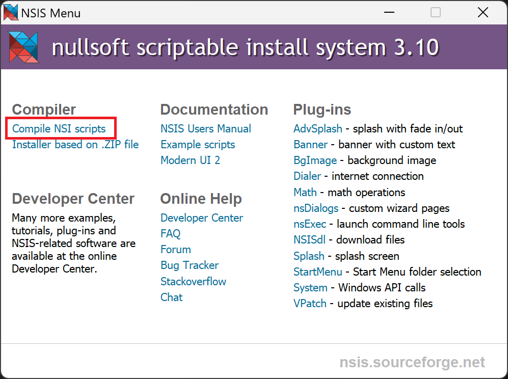
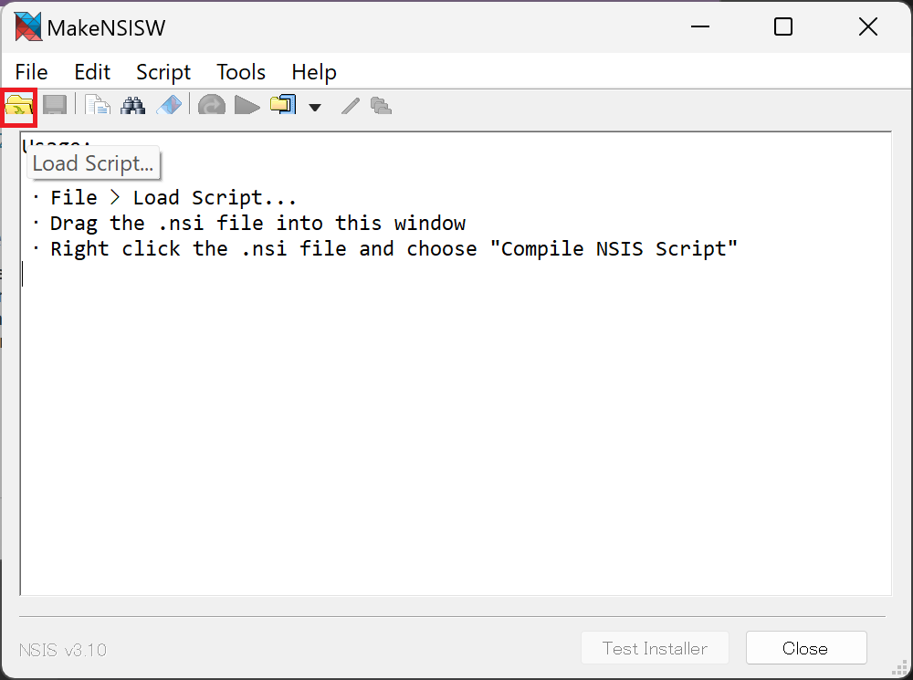
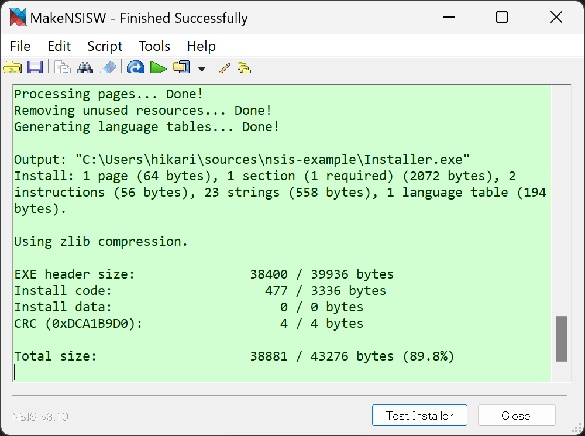

# nsis-example
これは、https://nsis.sourceforge.io/Simple_tutorials をもとに日本語で解説したものです。

## インストーラーをダウンロードする

以下のリンクから、スクリプトをコンパイルしインストーラーを作成するソフトウェアをダウンロードします。

- [ダウンロード](https://nsis.sourceforge.io/Download)

## スクリプトを作成
インストーラーを作成するにはスクリプトが必要です。
(日本語を含める場合は Shift-JIS で保存が必要です)

### シンプルなポップアップボックス (Hello, world)

例として以下のようなスクリプトを作成します。

- [simple.nsi](simple.nsi)

### コンパイル

NSIS を起動し、次のようにして作成したスクリプト (NSI ファイル) を選択します。

背景が緑色になれば成功です。

インストーラーは、nsi ファイルのあるディレクトリに生成されます。

[Test Installer] ボタンをクリックすると、生成されたインストーラーが起動します。

### テキストの書き込み
テキストをファイルに書き込む例です。

- [write-text.nsi](write-text.nsi)

### インストーラー
ファイルをインストールする例です。

- [install-file.nsi](install-file.nsi)

### インストーラーとアンインストーラー
上記のファイルのインストールとアンインストーラーを作成するインストーラーを作成します。

- [uninstaller.nsi](installer-uninstaller.nsi)

### スタートメニューの作成
スタートメニューを作成します。

- [startmenu.nsi](startmenu.nsi)

## インストーラーのサンプル
以下はディレクトリ `hikari-server\` を `%localappdata%\hikari-server\` にインストールする例です。
Modern UI 2.0 を使用します。

- [example.nsi](example.nsi)
